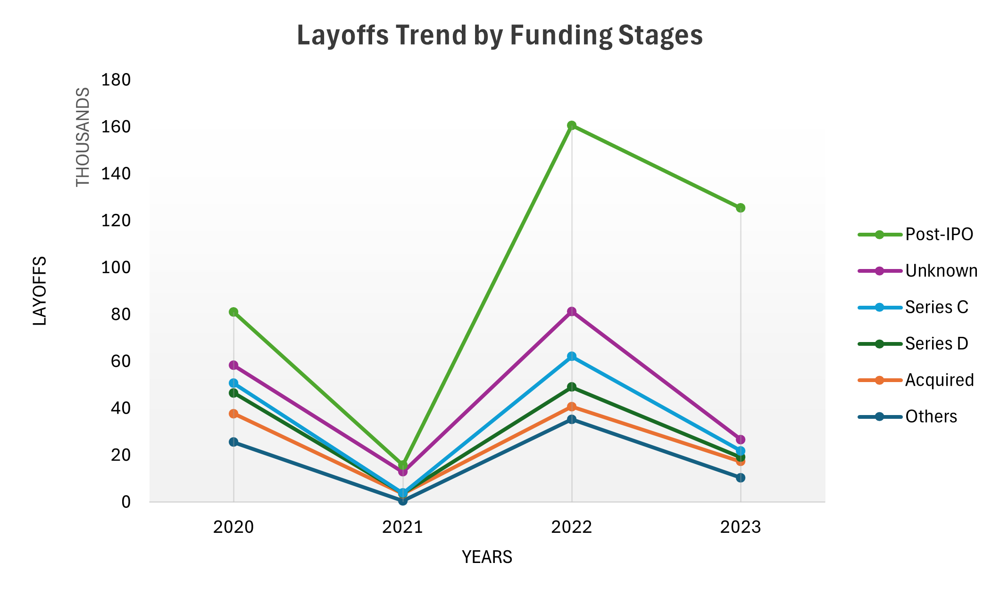
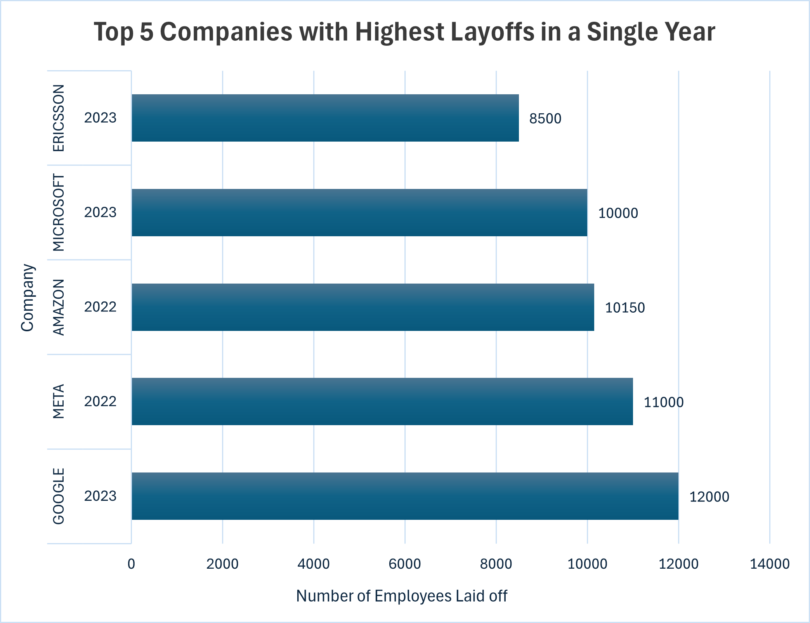
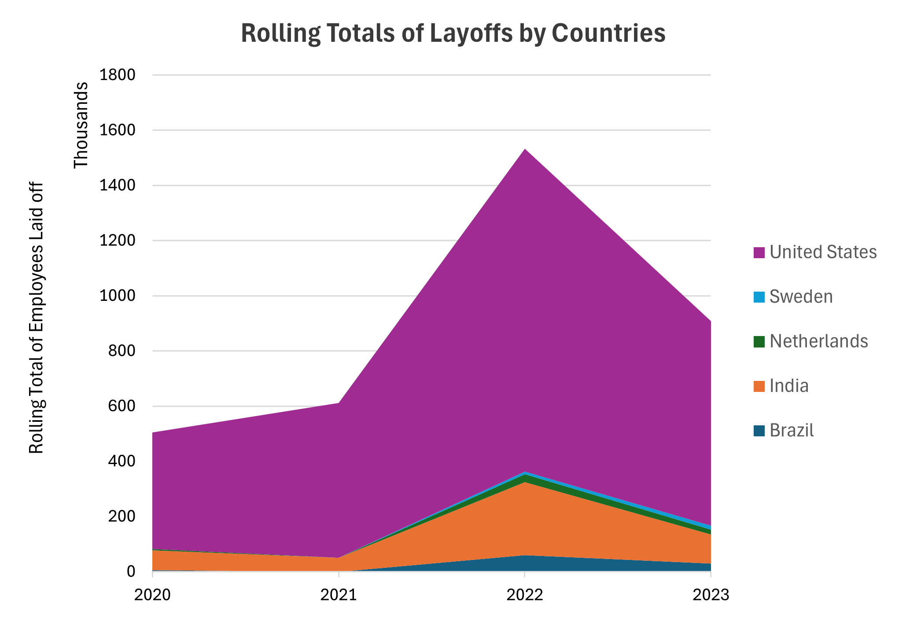
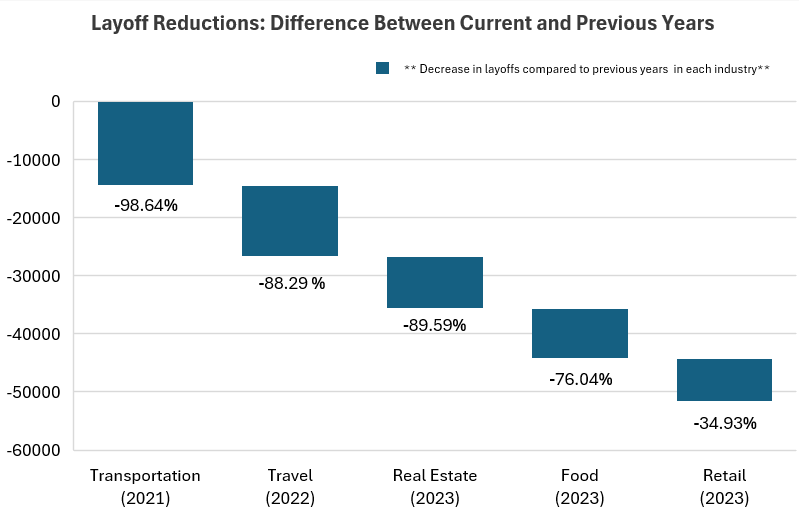

# Analyzing Global Tech Layoffs - SQL (MySQL)

> **Which companies, countries, and industries drove 383,000+ tech layoffs - and is the sector recovering?**
> Using SQL alone, this project cleans a raw global layoffs dataset and extracts a clear story about who laid off the most, when, and why — using window functions, CTEs, and aggregations from scratch.

[View data cleaning SQL script](./Data_Cleaning.sql)

[View EDA SQL script](./Exploratory_Data_Analysis.sql)

---

## The Bottom Line

Between 2020 and 2023, the global tech industry laid off over 383,000 people - not evenly, and not randomly. A handful of Post-IPO giants in the U.S. drove the majority of the damage, peaking in 2022. Meanwhile, sectors like Transportation had already recovered by 2021. This project shows how to take messy real-world data, clean it rigorously, and extract a clear business story using SQL alone.

---

## Key Findings at a Glance

| Finding | Detail |
|---------|--------|
| **Single largest layoff event** | Google laid off 12,000 employees in 2023 |
| **Hardest-hit funding stage** | Post-IPO companies - 160K+ layoffs in 2022 alone |
| **Highest cumulative layoffs** | U.S. rolling total reached ~1.5 million by end of 2022 |
| **Peak year** | 2022 - not 2020 as most assume |
| **Fastest recovery** | Transportation - 98.6% reduction in layoffs from 2020 to 2021 |
| **Top companies 2022–2023** | Google, Meta, Amazon, Microsoft, Ericsson |
| **Complete shutdowns** | Multiple Consumer and Retail companies laid off 100% of workforce in 2020–2022 |

---

## Project Overview

The tech industry experienced an unprecedented wave of workforce reductions between 2020 and 2023 - driven by pandemic-era overexpansion, rising interest rates, and post-IPO market corrections. This project uses SQL to clean and analyze a global layoffs dataset, answering four business-oriented questions:

1. Which companies and industries were most affected, and by how much?
2. Did layoffs increase or decrease year over year - and is there a recovery signal?
3. Which funding stages are tied to the highest layoff volumes?
4. Which countries bore the most cumulative workforce impact?

---

## Dataset

Global tech layoff records from March 2020 onward, sourced from public layoff tracking data.

**Fields included:**

| Field | Description |
|-------|-------------|
| `company` | Company name |
| `industry` | Industry sector |
| `country` | Country of layoff event |
| `date` | Date of layoff announcement |
| `total_laid_off` | Number of employees laid off |
| `percentage_laid_off` | Percentage of total workforce laid off |
| `stage` | Company funding stage (e.g. Post-IPO, Series C) |
| `funds_raised_millions` | Total funding raised |

**Raw data issues addressed during cleaning:**
- Duplicate records
- Inconsistent text formatting in `industry` and `stage` columns
- Date stored as text (`MM/DD/YYYY`) instead of SQL `DATE` type
- Null values in key analytical fields
- Redundant staging columns

---

## Tools Used

- **MySQL** - all cleaning and analysis done entirely in SQL
- **Staging table approach** - original data preserved, all work done on a clean copy

---

## Methodology

### 1. Data Cleaning

[View data cleaning SQL script](./Data_Cleaning.sql)

All cleaning was performed in SQL using a staging table (`layoffs_staging2`) - keeping the original data intact while working on a clean copy.

| Step | SQL Technique | Why It Matters |
|------|--------------|----------------|
| Removed duplicates | `ROW_NUMBER() OVER(PARTITION BY)` on all identifying columns | Simple DELETE would miss compound duplicates sharing only some fields |
| Standardized industry column | `TRIM()`, `UPDATE` with `WHERE LIKE` | "Crypto" and "CryptoCurrency" unified - without this, industry aggregations silently undercount |
| Standardized stage column | Text normalization queries | Consistent stage labels required for funding-stage analysis |
| Converted date format | `STR_TO_DATE()`, `ALTER TABLE` to change column type | Text dates cannot be used in `YEAR()`, `MONTH()`, or `DATEDIFF()` functions |
| Handled nulls deliberately | Removed rows where both `total_laid_off` AND `percentage_laid_off` were NULL | Rows with no layoff data carry no analytical value - but nulls in one field only were kept to avoid distorting averages |
| Dropped staging columns | `ALTER TABLE DROP COLUMN` | Keeps working table lean for query performance |

### 2. Exploratory Data Analysis (EDA)

[View EDA SQL script](./Exploratory_Data_Analysis.sql)

SQL was used to systematically answer each business question - moving from simple aggregations to advanced window functions as the analysis deepened.

---

#### Layoff Scale & Complete Shutdowns
- Queried for maximum single-event layoffs using `MAX(total_laid_off)`
- Identified companies with `percentage_laid_off = 1` - full shutdowns, not just downsizing
- **Finding:** Multiple Consumer and Retail companies fully shut down during 2020–2022, concentrated in early-stage funding rounds where cash reserves were thinnest

---

#### Industry & Country Aggregations
```sql
SELECT industry, SUM(total_laid_off) AS total
FROM layoffs_staging2
GROUP BY industry
ORDER BY total DESC;
```
- **Finding:** Consumer and Retail were the most impacted industries. The U.S. accounted for a disproportionate share of global layoffs - reflecting aggressive pandemic-era overhiring by American tech firms

---

#### Year-over-Year Trend Analysis
```sql
SELECT YEAR(date) AS year, SUM(total_laid_off) AS total
FROM layoffs_staging2
GROUP BY year
ORDER BY year;
```
- **Finding:** Layoffs spiked sharply in 2022 - not 2020 as most assume. The COVID year triggered layoffs, but the real correction came later as overvalued tech companies adjusted to rising interest rates and slowing growth. 2023 remained elevated, indicating a prolonged correction rather than a sudden one.

---

#### Rolling Totals by Country - Window Functions
```sql
SELECT country, SUBSTRING(date, 1, 7) AS month,
       SUM(total_laid_off) OVER(PARTITION BY country ORDER BY SUBSTRING(date, 1, 7)) AS rolling_total
FROM layoffs_staging2
ORDER BY country, month;
```
- **Finding:** The U.S. cumulative rolling total reached approximately 1.5 million by end of 2022 - dwarfing every other country. India, Brazil, Netherlands, and Sweden combined barely registered on the same scale

---

#### Top 5 Companies per Year - DENSE_RANK()
```sql
WITH company_year AS (
  SELECT company, YEAR(date) AS year, SUM(total_laid_off) AS total
  FROM layoffs_staging2
  GROUP BY company, year
),
ranked AS (
  SELECT *, DENSE_RANK() OVER(PARTITION BY year ORDER BY total DESC) AS ranking
  FROM company_year
)
SELECT * FROM ranked WHERE ranking <= 5;
```
- **Finding:** Google, Meta, Amazon, Microsoft, and Ericsson dominated 2022–2023. Google's 12,000-person cut in 2023 was the single largest event - from a company that had been publicly profitable throughout the period

---

#### Year-over-Year Recovery Detection - LAG()
```sql
WITH industry_year AS (
  SELECT industry, YEAR(date) AS year, SUM(total_laid_off) AS total
  FROM layoffs_staging2
  GROUP BY industry, year
),
lagged AS (
  SELECT *, LAG(total) OVER(PARTITION BY industry ORDER BY year) AS prev_year
  FROM industry_year
)
SELECT *, ROUND((total - prev_year) / prev_year * 100, 2) AS pct_change
FROM lagged
ORDER BY pct_change ASC;
```
- **Finding:** Transportation saw a 98.6% reduction in layoffs from 2020 to 2021 - the fastest recovery of any industry. Travel, Real Estate, Food, and Retail all showed reductions exceeding 85%. These are demand-driven industries where pent-up post-lockdown demand absorbed displaced workers quickly - contrasting sharply with tech, where 2022–2023 cuts reflect longer-term strategic restructuring

---

## Results Summary

### 1. Layoffs by Funding Stage
Post-IPO companies laid off **160K+ employees in 2022** - far exceeding every other funding category. Despite a slight decline in 2023, Post-IPO remained the most affected stage, indicating prolonged instability in public markets.



### 2. Top 5 Companies per Year
Google (12,000), Microsoft (10,000), Amazon (10,150), Meta, and Ericsson (8,500) dominated 2022–2023 - all profitable companies making strategic workforce resets, not emergency cuts.



### 3. Rolling Layoff Totals by Country
U.S. cumulative total reached ~1.5 million by end of 2022. India, Brazil, Netherlands, and Sweden combined were barely visible on the same scale.



### 4. Industries with Largest YoY Reductions
Transportation: **-98.6%** from 2020 to 2021. Travel, Real Estate, Food, and Retail all recovered faster than tech - driven by post-lockdown demand rather than structural correction.



---

## SQL Concepts Used

| Category | Functions / Techniques |
|----------|----------------------|
| **Aggregations** | `SUM()`, `AVG()`, `ROUND()`, `MAX()`, `COUNT()` |
| **Grouping** | `GROUP BY`, `ORDER BY`, `HAVING` |
| **CTEs** | `WITH` clauses for multi-step analysis |
| **Window Functions** | `ROW_NUMBER()`, `DENSE_RANK()`, `LAG()`, `SUM() OVER()` |
| **Partitioning** | `PARTITION BY` for year-wise and country-wise breakdowns |
| **Temporal Functions** | `YEAR()`, `SUBSTRING()`, `STR_TO_DATE()`, `DATEDIFF()` |
| **Data Cleaning** | `TRIM()`, `UPDATE`, `ALTER TABLE`, `DELETE`, staging tables |

---

## Limitations & Next Steps

- **Voluntary departures not captured** - this dataset tracks announced layoffs only. Net workforce impact at any company is likely different from the numbers shown.
- **Rehiring not tracked** - a company that laid off 5,000 and rehired 3,000 looks the same as one that did not rehire at all.
- **Revenue context missing** - Google laying off 12,000 is a different signal than a Series B startup laying off 200. Normalizing against headcount or revenue would make comparisons more meaningful.
- **Natural next step** - connect this SQL analysis to a Tableau or Power BI dashboard for interactive exploration by industry, country, and funding stage.

---

## Connect

**Portfolio:** [surbhiparmar01.github.io](https://surbhiparmar01.github.io)
**LinkedIn:** [linkedin.com/in/surbhiparmar](https://www.linkedin.com/in/surbhiparmar/)
**GitHub:** [github.com/SurbhiParmar01](https://github.com/SurbhiParmar01)
